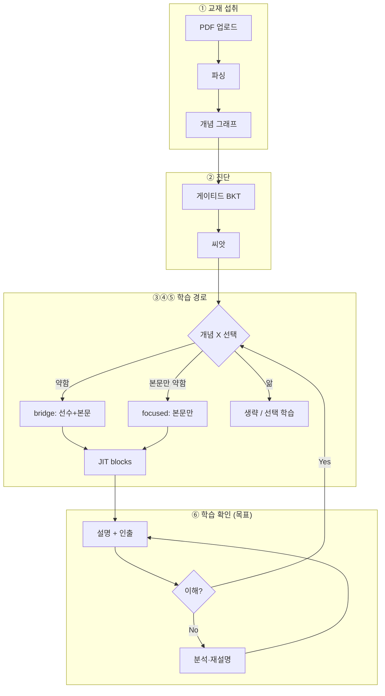

# MetaLearn 프로젝트 컨텍스트

> **고정 맥락 문서** — 제품 철학, 아키텍처, 코딩 원칙.  
> **작업 일지·이슈·다음 액션** → [`WORK_LOG.md`](./WORK_LOG.md) (세션마다 맨 위에 append)

---

## 0. 에이전트 시작 절차 (Cursor / Claude CLI)

```
1. docs/CLAUDE_CONTEXT.md  읽기  (이 파일)
2. docs/WORK_LOG.md        읽기  (최신 세션 + 열린 이슈 + 다음 액션)
3. WORK_LOG의 변경 파일·이슈 기준으로 코드 확인
4. 작업 수행
5. 종료 시 WORK_LOG 맨 위에 세션 로그 추가
6. 구현 상태 바뀌면 이 파일 §3·§7 표만 갱신
```

Claude CLI 예시:

```bash
cd metalearn
claude "docs/CLAUDE_CONTEXT.md 와 docs/WORK_LOG.md 를 읽고 동기화 완료 후 WORK_LOG 다음 액션부터 진행해줘"
```

---

## 1. MetaLearn이 뭔가 (제품 한 줄)

**개인 교재(PDF)를 LLM이 파싱해 개념 그래프를 만들고, 그 그래프로 진단 문제를 내 사용자 수준을 파악한 뒤, 그 결과(씨앗)로 개념별 맞춤 JIT 커리큘럼을 생성하는 적응형 AI 학습 플랫폼.**

장기 비전: 하이브리드 AI (온라인=Upstage Solar, 오프라인=브라우저 로컬 EXAONE). **현재는 Solar 클라우드 경로만 실동작.**

---

## 2. 제품 철학 (반드시 이 사고방식으로 구현)

### 2.1 핵심 루프

```
PDF 업로드 → 파싱 → 개념+선수지식 그래프
→ 개념별 진단 문제 → 사용자 수준 파악 (씨앗)
→ 개념별 JIT 커리큘럼 → 학습 중 확인·보강 (목표)
```

### 2.2 수준 파악의 의미

- 개념 A 문제를 틀렸다 → A를 모른다.
- **선수지식도 모르면** A만 설명해도 이해 못 함 → **선수부터 뼈대 쌓고 A 설명**.
- A는 약하지만 선수는 안다 → **교재 본문(A)만** 집중.
- **전원에게 선수를 깔지 않음.** 개념마다 다르게 판단.

### 2.3 씨앗(seed)

- **「이 사용자 × 이 교재」의 개념별 프로필** (`concept_mastery.strength` 등).
- **bridge**: 약한 선수 설명 + 본문(A) 둘 다
- **focused**: 본문(A)만
- **생략/선택**: 충분히 앎 → 자동 추천 제외, 수동으로 심화 학습 가능

### 2.4 커리큘럼 = 개념 X 단위 JIT

- 고정 CMS(`chapters/sections/blocks` 테이블) 아님 → `curricula.blocks` JSON.
- 블록: `chapter`(이론) → `cloze`/`inverse`(인출). 정답 떠먹이지 않음.

### 2.5 학습 중 확인 루프 (목표, 미완)

- 틀리면: **왜 못 풀었는지 분석** → 재설명 또는 커리큘럼 재생성 → 맞을 때까지.
- 현재: 프론트 **자가 확인(정답 공개)** 만. → [`WORK_LOG.md`](./WORK_LOG.md) ISSUE-005

---

## 3. 전체 흐름 다이어그램



### 구현 상태 (다이어그램 구간별)

| 구간 | 상태 | 비고 |
|------|------|------|
| ① 교재 섭취 | ✅ | ISSUE-008/009/013/014 + 비동기 ingest(ISSUE-010, 업로드 0.25초 응답+폴링) |
| ② 진단 | ✅ | **온보딩으로 재설계(진단 재설계 브랜치)** — 성향 3축 프로파일링 + 기반지식 갭 체크(선수 사슬 하강 재활용). `POST /api/diagnostic/onboarding/*`. floor로 범위 안 자름(전 절 todo). 구 배치고사(placement)·전수는 lab 동결 |
| ③ 씨앗 | ✅ | 온보딩 종료 시 `finalize_onboarding`(전 절 todo 시딩 + 갭 기록 + 선수 에지 역주입) — 슬러그·external_refs 포함. 구 경로는 `finalize_placement` |
| ④ 라우팅 | ⚠️ | 약한 개념 자동만; 명시 스킵 없음 |
| ⑤ bridge/focused | ✅ | ISSUE-007 수정 완료 — 선수 강도까지 반영해서 모드 결정 |
| ⑥ 학습 루프 | ⚠️ | 복습 국면 착수(진단 재설계) — 다음 장 생성 시 SM-2 due + 오답노트로 「복습·오답 체크」섹션 맨 앞 주입(`run_chapter_generation`), 첫 생성 맞춤=성향 지시문만. 확인 재설명 루프(ISSUE-005)는 남음 |

> 상세 이슈·다음 작업: [`WORK_LOG.md`](./WORK_LOG.md)

---

## 4. 기술 스택

| 영역 | 기술 |
|------|------|
| Backend | Python 3.12, FastAPI, uv, SQLAlchemy 2, Alembic |
| Frontend | React 19, Vite 6, TypeScript, pnpm, TanStack Query, Zustand |
| DB | PostgreSQL 16 + pgvector (halfvec) |
| AI | Upstage Solar |
| Infra | Docker Compose |

```bash
docker compose up --build
docker compose exec backend uv run alembic upgrade head
```

| Lab UI | `/lab/documents`, `/lab/diagnostic`, `/lab/curriculum` |

---

## 5. 데이터 모델

```
users → documents → courses → concepts, concept_edges
              ├── enrollments, diagnostic_sessions
              │     ├── concept_mastery (strength)  ← 씨앗
              │     └── diagnostic_questions
              └── curricula (JIT blocks JSON)
```

### 팀 스키마 rename (0009)

`materials`→`documents`, `markdown`→`raw_text`, `p_known`→`strength`, `concept_prerequisites`→`concept_edges` 등.

### 의도적으로 안 넣은 것

4단 CMS, doc_chunks RAG, serve_variant, related/application 엣지, ceiling/floor 진단, SM-2/결제/알림/push, UUID PK.

---

## 6. 핵심 로직 요약

### Ingestion
PDF → `raw_text` → 개념 추출 → embed(name+description) → `concept_edges`

### 진단
BKT `strength`; 게이티드(메인 우선, 오답 시 선수 1단계); 그래프 전파 2-hop.

### 커리큘럼
`strength ≥ 0.5` → **focused** (본문 100%)
`strength < 0.5` **그리고** 직접 선수 중 약한 것이 있음 → **bridge** (그 약한 선수 40% + 본문 60%)
`strength < 0.5` 이지만 직접 선수가 전부 이미 앎(또는 선수 자체가 없음) → **focused** (본문만 — "A는 약해도 선수는 안다" 케이스, ISSUE-007로 2026-07-02 수정)

### 프론트
`flowStore`: courseId → sessionId → conceptId  
진단 완료 → `pickWeakestForCurriculum()` (모름 중 최약)

---

## 7. 구현 상태 요약

| 영역 | 상태 |
|------|------|
| documents ingestion | ✅ 비동기(백그라운드+단계 폴링) — ISSUE-008·009·010·013·014 closed |
| 온보딩 진단 (실사용) | ✅ 진단 재설계 — `POST /api/diagnostic/onboarding/*`: 성향 4문항+프로브 → 기반지식 하강 → 프로필(`learner_profiles`, migration 0019) + 갭 + 선수 에지 역주입. 실 DB+LLM E2E 통과(2026-07-09) |
| 성향 프로파일 | ✅ `GET/PATCH /api/profile/me` — 3축(representation/rigor/context) EMA, 생성 지시문 결정적 변환(`directive_from_axes`) |
| 복습 인출 (다음 장 주입) | ✅ `collect_review_concepts`(오답노트+SM-2 due) + `generate_retrieval_blocks`(cloze/mcq) → 챕터 맨 앞 복습 섹션 |
| 배치고사·전수 진단 (구형) | ✅ lab 동결 — `POST /api/diagnostic/placement/start`·`/start`. 정밀 판정은 학습 중 인출로 이관 |
| bridge/focused curriculum | ✅ ISSUE-007 수정 완료 |
| seed | ✅ 온보딩=`finalize_onboarding`(전 절 todo) / 구형=`finalize_placement` + 슬러그 + external_refs(위키+LLM 폴백) |
| auth | ⬜ 스텁 (`dev@local`) |
| 학습 중 적응 루프 | ❌ ISSUE-005 (팀원 파트와 통합) |
| UUID 이관 | ⬜ **다음 관문** — 팀원 실연동 직전 일괄 (migration head=0019, mlv2-db 적용 완료) |

---

## 8. 코딩 원칙

1. 제품 루프 밖 기능 추가 금지 (팀 full SaaS 스키마 일괄 이식 X)
2. **bridge ≠ 선수만** — 선수+본문
3. 개념 단위 JIT (교재 전체 일괄 X)
4. `features/` 5레이어: router → schemas → service → repository → models
5. 최소 diff, 한국어 UX, `documents` 기준 (README `materials`는 구식)

---

## 9. 우선 구현 후보

1. **개념 추출 품질** (ISSUE-008) — 파트별 분할 추출, 6장 누락, 선수관계·이름 중복
2. 학습 중 확인 루프 (ISSUE-005)
3. seed formalize (ISSUE-004)
3. seed formalize (ISSUE-004)
4. auth
5. 씨앗 기반 “다음 개념” 추천
6. (선택) doc_chunks — 인용 UI 넣을 때만

---

## 10. 작업 시 우선 읽을 파일

```
backend/app/features/documents/service.py
backend/app/features/diagnostic/service.py
backend/app/features/diagnostic/bkt.py
backend/app/features/learning/service.py
backend/app/core/config.py
frontend/src/shared/store/flowStore.ts
frontend/src/features/diagnostic/components/DiagnosticPanel.tsx
frontend/src/features/learning/components/CurriculumView.tsx
```

---

## 11. API

- `POST /api/documents/upload` → CourseDetail (`id` = course_id)
- `POST /api/diagnostic/start` `{ course_id }`
- `POST /api/learning/curriculum` `{ concept_id, session_id?, force_regenerate? }`

---

## 12. 에이전트 지시

- **이미 알고 있는 팀원**처럼 행동.
- 새 기능은 「씨앗 → bridge/focused → 학습 적응」 루프에 맞는지 먼저 검증.
- README만 믿지 말고 `features/` 코드 확인.
- **작업 내역은 `WORK_LOG.md`에, 이 파일은 맥락만.**
